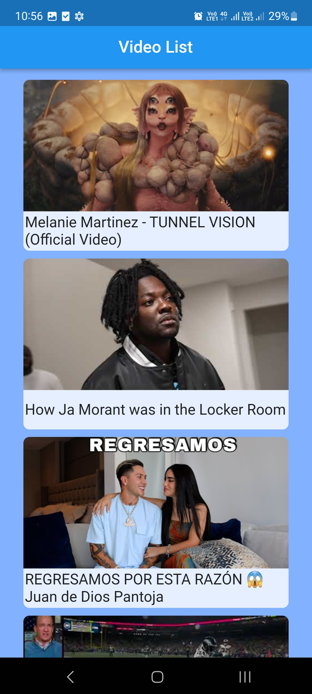
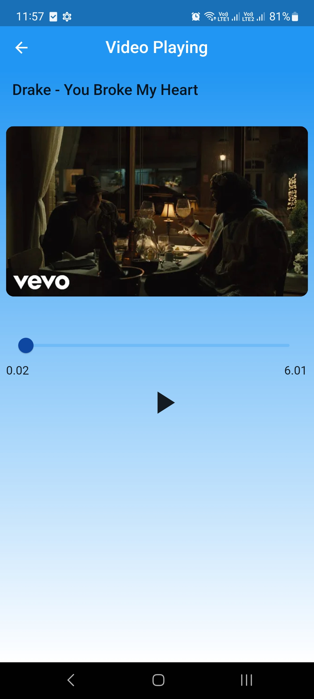

# Video Player

A simple video player application using Flutter that allows users to play, pause, and seek through a video.

- Contains 3 screens  -  Splash Screen , Video listing Screen ,  Video Playing Screen
- Used Youtube Api to fetch and list videos.
- Plugin called "youtube_player_flutter" is used to play youtube videos.

Attention : API KEY is not present in this repository . therefore youtube apiKey is required to use this video player. so please add key to this folder "lib/infrastructure/api_key".

## Video Player Demo

## Video Player UI

